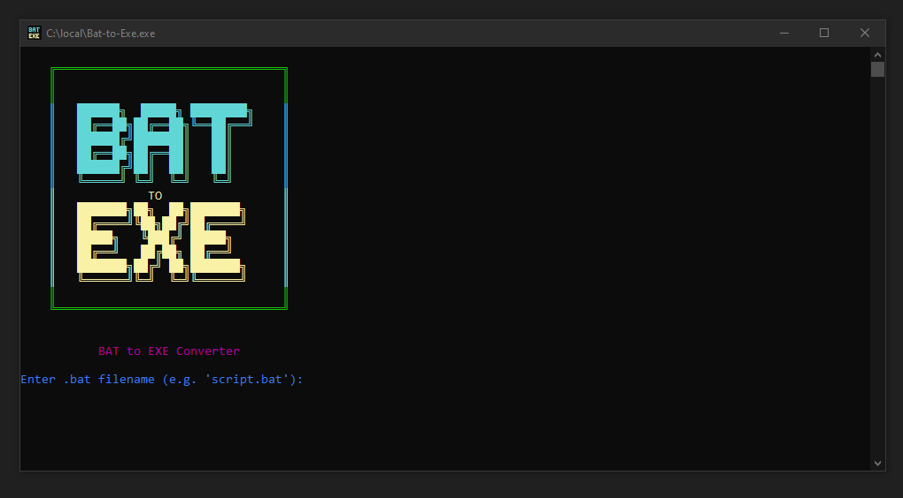

# 🛠️ Bat-to-Exe Converter

A simple and user-friendly tool to convert your `.bat` (batch) scripts into standalone `.exe` executables.  

---

## 📦 Features

- 🔍 Select any `.bat` file to convert
- 🎭 Choose between **Visible** or **Invisible** execution
- 📁 Automatically handles converter setup
- 💡 Simple and clean console interface
- ✅ One-click `.exe` creation

---

## 🚀 How to Use
1. **Download** `Bat-to-Exe.exe`.
2. **Run** `Bat-to-Exe.exe`.
3. **Enter** your `.bat` filename (e.g., `backup_script.bat`).
4. **Select visibility mode:**

   - ✅ **Visible** – Shows a console window (ideal for debugging)
   - ❌ **Invisible** – Runs silently in the background (great for automation)

5. **Press Enter** – Your `.exe` will generate in the same folder!

---

## 📦 Features

- 🔍 Browse and select `.bat` files easily
- 🎭 Choose between **Visible** or **Invisible** execution
- ⚡ Fast, lightweight, and portable

---

## 🧰 Requirements

The app includes all necessary dependencies.  

## 📸 Screenshot

✨ Happy converting! Let your scripts shine (or hide) as EXEs! 🚀

